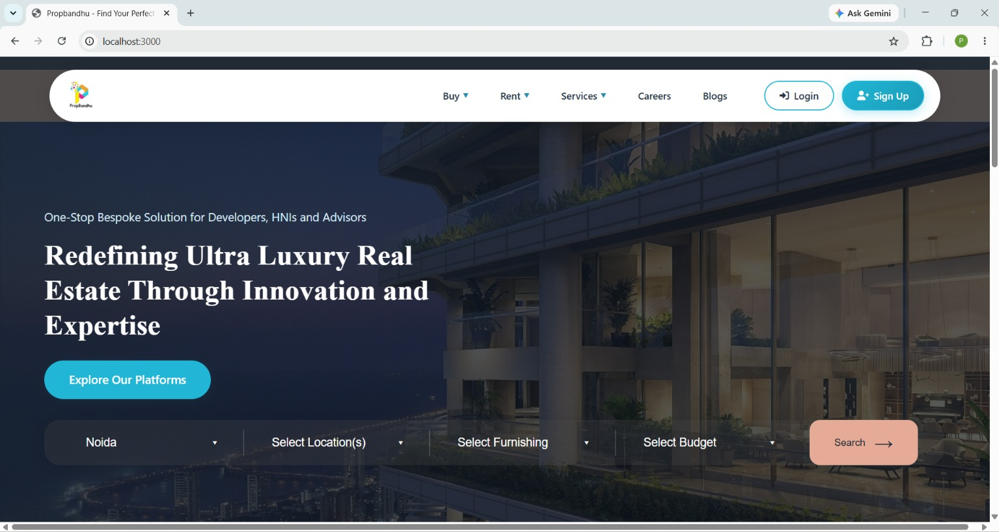
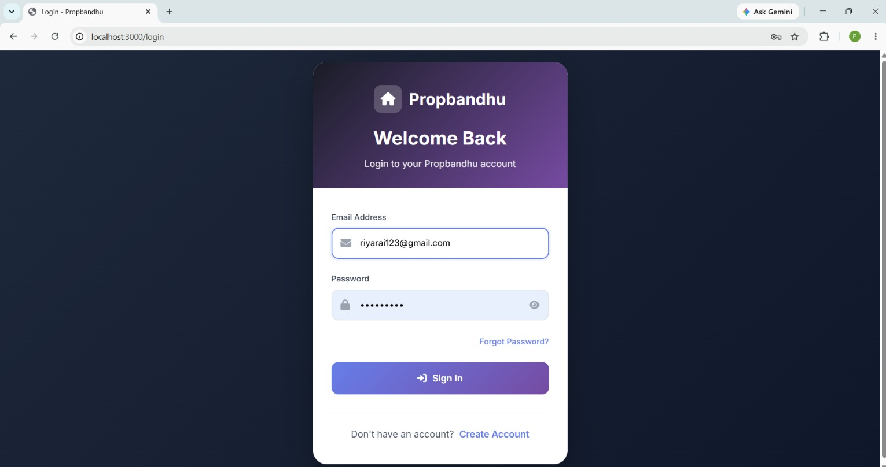
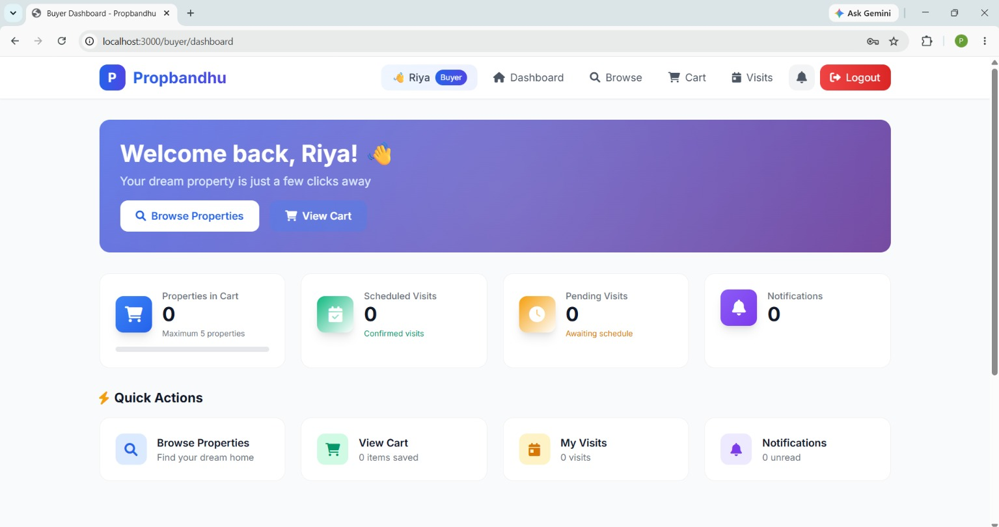
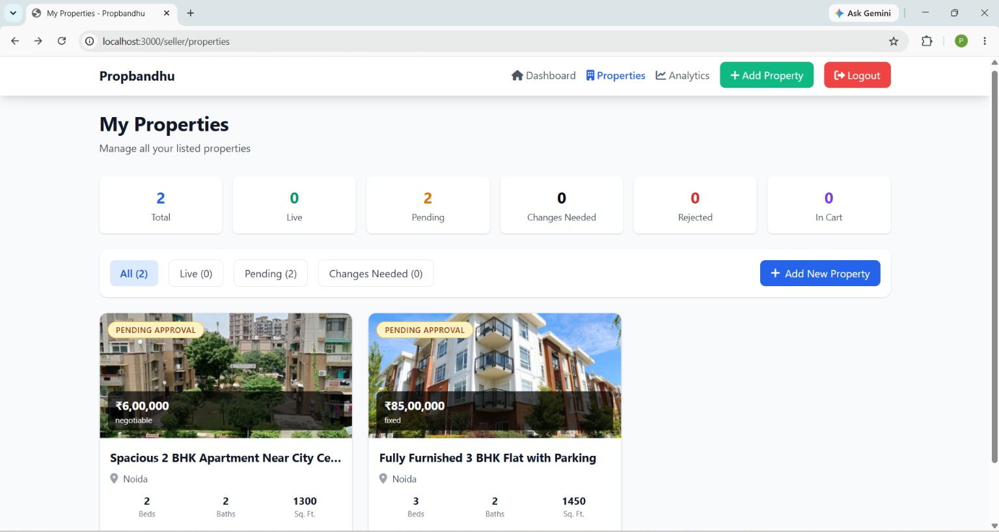

# 🏡 Property Rental System

A full-stack **Property Rental System** built using **Node.js, Express.js, MongoDB, EJS, and Bootstrap**. The platform enables buyers, sellers, brokers, and administrators to securely manage property listings, bookings, document verification, and user interactions through role-based authentication and authorization.

> **Internship Project**
>
> This project was developed during my **Software Development Internship at Multitask Technologies**. My primary contributions included implementing secure authentication, role-based authorization, RESTful APIs, and collaborating on backend feature development as part of the development team.

---

## ✨ Features

- 🔐 Secure User Authentication
- 👥 Role-Based Access Control
  - Admin
  - Buyer
  - Seller
  - Broker
- 🏠 Property Listing Management
- 📅 Property Booking System
- 📂 Document Upload & Verification
- 📩 Notification System
- 📊 Dedicated Dashboards for Each User Role
- 🔍 Property Search & Filtering
- 📱 Responsive User Interface

---

## 🛠️ Tech Stack

### Frontend
- EJS
- HTML5
- CSS3
- Bootstrap
- JavaScript

### Backend
- Node.js
- Express.js

### Database
- MongoDB
- Mongoose

### Authentication & Security
- Passport.js
- Express Session
- Role-Based Authorization

---

## 📂 Project Structure

```text
Property_Rental_System/
│
├── controllers/
├── middleware/
├── models/
├── public/
│   ├── assets/
│   ├── css/
│   └── js/
├── routes/
├── services/
├── screenshots/
├── views/
├── package.json
├── package-lock.json
├── .env
└── server.js
```

---

## 🚀 Installation

### Clone the Repository

```bash
git clone https://github.com/PriyanshuKumari1409/Property_Rental_System.git
```

### Navigate to the Project

```bash
cd Property_Rental_System
```

### Install Dependencies

```bash
npm install
```

### Configure Environment Variables

Create a `.env` file in the project root.

```env
MONGO_URI=your_mongodb_connection_string
SESSION_SECRET=your_session_secret
PORT=3000
```

### Start the Server

```bash
node server.js
```

Open your browser and visit:

```text
http://localhost:3000
```

---

## 📸 Screenshots

### Home Page



---

### Login Page



---

### Buyer Dashboard



---

### Seller Dashboard



---

## 👨‍💻 My Contributions

During my internship at **Multitask Technologies**, I contributed to:

- Implemented secure authentication using Passport.js and Express Session.
- Developed role-based authorization for Admin, Buyer, Seller, and Broker modules.
- Built RESTful APIs using Node.js and Express.js.
- Integrated MongoDB models using Mongoose.
- Contributed to property management, booking, notification, and dashboard modules.
- Assisted in backend development, debugging, testing, and feature integration.

---

## 📈 Future Enhancements

- 💳 Online Payment Gateway
- 🤖 AI-Based Property Recommendation
- 💬 Real-Time Chat
- 🗺️ Google Maps Integration
- 📧 Email Notifications
- 📊 Property Analytics Dashboard

---

## 🤝 Acknowledgements

This project was developed during my **Software Development Internship at Multitask Technologies** in collaboration with the development team.

---

## 👤 Author

**Priyanshu Kumari**

- GitHub: https://github.com/PriyanshuKumari1409

---
